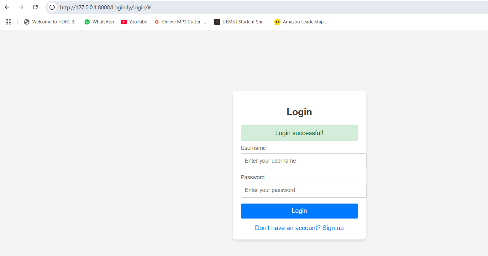

# DjangoProject
# Task1
## Here are the Images and steps

# Task2

# Task3

## First these are login and signup pages.

## on clicking signup link page will be redirected to signup page after creating users page will be redirected to login page.

## Now while creating user if the user alredy exist then the message will be shown like user exists.

## Now when trying to login if username and password matches then login successful message will pop up else there will be error message please refer the images.

